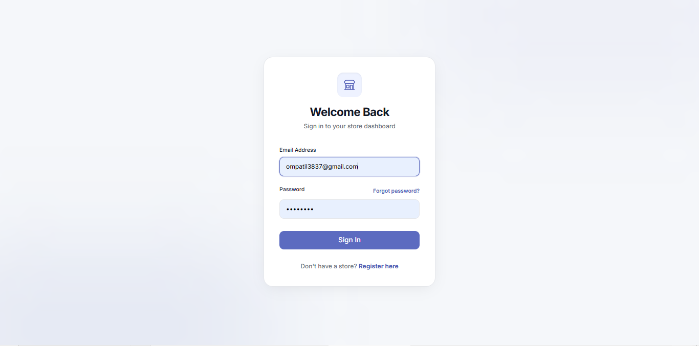
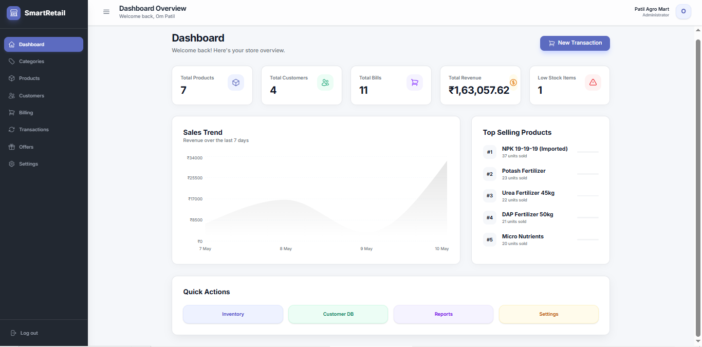
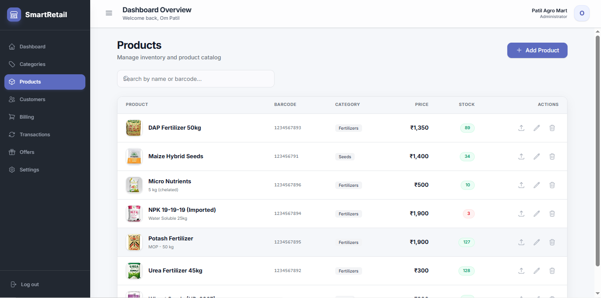
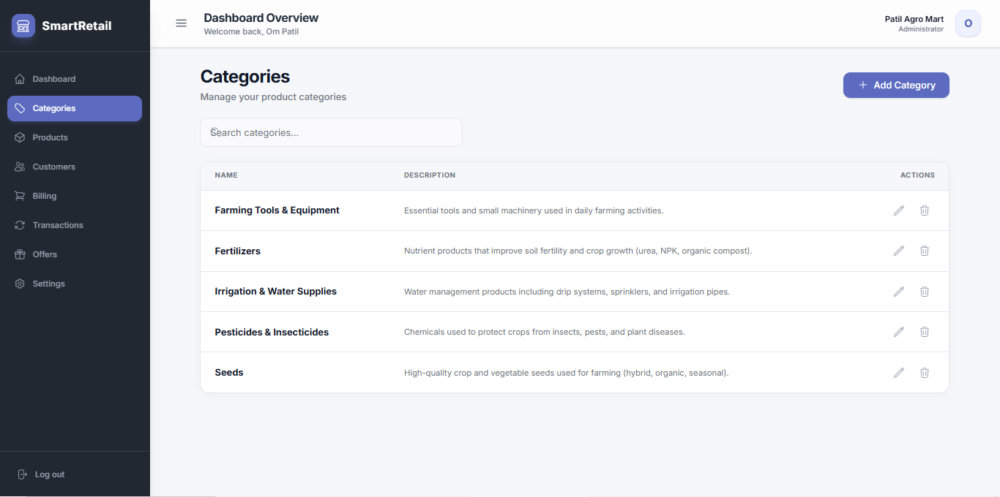
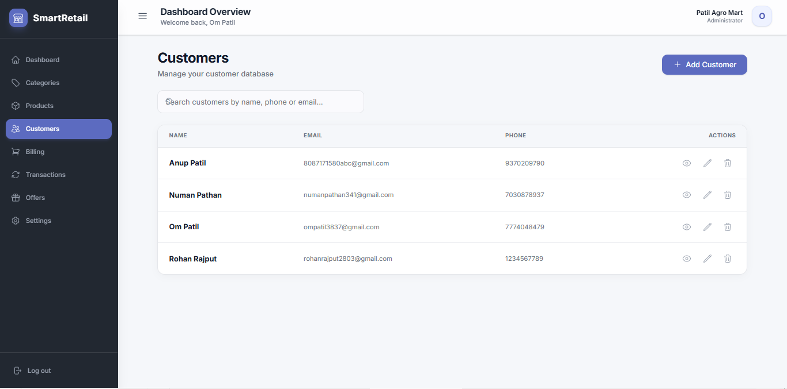
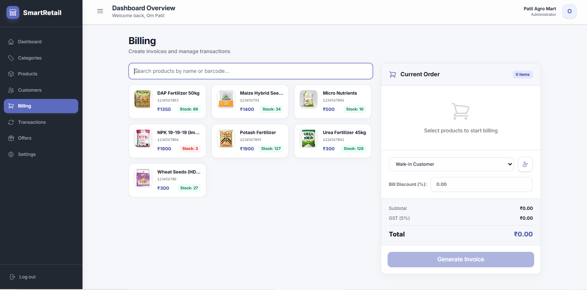
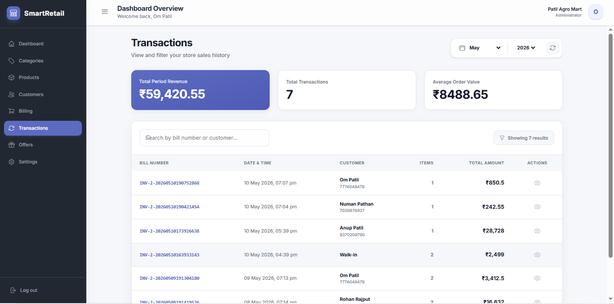
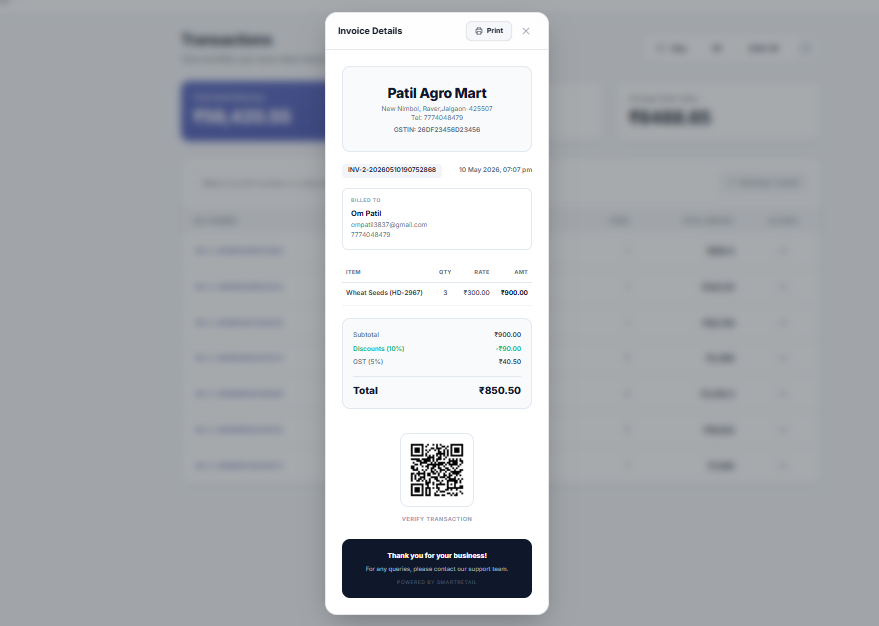
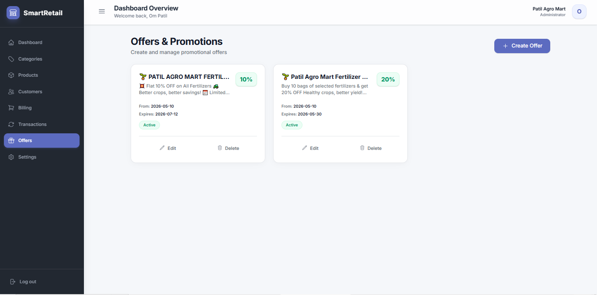

# 🛒 Smart Retail System (Multi-Tenant SaaS)

<p align="center">


</p>

> **A modern Multi-Tenant Retail Management System built using Java, Spring Boot, Spring Security (JWT), React, and MySQL.**
>
> Each store has its own secure workspace to manage inventory, customers, billing, offers, analytics, and transactions independently.

---

# ✨ Features

- 🔐 JWT Authentication & Authorization
- 🏪 Multi-Tenant SaaS Architecture
- 📊 Interactive Analytics Dashboard
- 📈 Sales Trend Analytics
- 💰 Revenue Tracking
- 📦 Product & Inventory Management
- 🗂️ Category Management
- 👥 Customer Management
- 🧾 Smart Billing System
- 📜 Billing History & Transactions
- 🧮 Automatic GST Calculation
- 🎁 Offer & Promotion Management
- 📧 Email Invoice Delivery
- 🖨️ Printable Invoice with QR Code
- 📱 Modern Responsive UI
- 🔍 Advanced Search & Filtering
- 🔒 Secure REST APIs

---

# 🛠️ Tech Stack

| Category | Technology |
|-----------|------------|
| Backend | Java, Spring Boot |
| Security | Spring Security, JWT |
| Database | MySQL |
| ORM | Spring Data JPA (Hibernate) |
| Frontend | React.js |
| Build Tool | Maven |
| API Testing | Postman |
| Version Control | Git & GitHub |

---

# 📂 Project Structure

```
SmartRetail-v2
│
├── backend
│   ├── controller
│   ├── service
│   ├── repository
│   ├── entity
│   ├── dto
│   ├── security
│   ├── config
│   ├── exception
│   └── resources
│
├── frontend
│
└── README.md
```

---

# 🔗 API Endpoints

| Module | Method | Endpoint | Authentication |
|--------|--------|----------|----------------|
| Register | POST | `/api/v1/auth/register` | ❌ No |
| Login | POST | `/api/v1/auth/login` | ❌ No |
| Dashboard | GET | `/api/v1/store/dashboard` | ✅ JWT |
| Store | GET, PUT | `/api/v1/store` | ✅ JWT |
| Categories | CRUD | `/api/v1/categories` | ✅ JWT |
| Products | CRUD | `/api/v1/products` | ✅ JWT |
| Customers | CRUD | `/api/v1/customers` | ✅ JWT |
| Bills | GET, POST | `/api/v1/bills` | ✅ JWT |
| Offers | CRUD | `/api/v1/offers` | ✅ JWT |

---

# 📸 Project Screenshots

## 🔐 Login

Secure login using JWT Authentication.



---

## 📊 Analytics Dashboard

Real-time dashboard displaying revenue, customers, products, sales trends, top-selling products, and low-stock alerts.



---

## 📦 Product Management

Manage inventory, pricing, stock levels, and product details.



---

## 🗂️ Category Management

Organize products into categories with search and CRUD operations.



---

## 👥 Customer Management

Manage customer records with search functionality.



---

## 🧾 Smart Billing

Generate invoices with GST calculation, discounts, customer selection, and automatic stock updates.



---

## 📜 Transaction History

View invoice history, revenue summary, monthly filtering, and transaction search.



---

## 🧾 Printable Invoice

Professional GST invoice with QR Code and print support.



---

## 🎁 Offers & Promotions

Create and manage promotional offers with discount percentages and expiry dates.



---

# 🚀 Getting Started

## Clone Repository

```bash
git clone https://github.com/Ompatil-999/SmartRetail-v2.git
```

---

## Navigate

```bash
cd SmartRetail-v2
```

---

## Configure Database

Create your own

```
application.yml
```

Configure

- MySQL URL
- Username
- Password
- JWT Secret
- Mail Configuration

> **Note:** `application.yml` is intentionally excluded from GitHub for security reasons.

---

## Run Backend

```bash
mvn spring-boot:run
```

---

## Run Frontend

```bash
npm install
npm run dev
```

---

# 🔒 Security

- JWT Authentication
- BCrypt Password Encryption
- Stateless Authentication
- Protected REST APIs
- Secure Password Storage

---

# 🚀 Future Enhancements

- 📊 Sales Reports & Charts
- ☁️ AWS Deployment
- 🐳 Docker Support
- 📱 Mobile Application
- 🔔 Low Stock Notifications
- 📈 Business Intelligence Dashboard
- 📄 PDF & Excel Reports
- 💳 Online Payment Integration

---

# 👨‍💻 Author

## Om Patil

**MCA Student | Java Backend Developer**

- Java
- Spring Boot
- Spring Security
- REST APIs
- MySQL
- Hibernate
- React
- Cloud & DevOps (Learning)

---

## ⭐ Support

If you found this project helpful, please consider giving it a ⭐ on GitHub.
